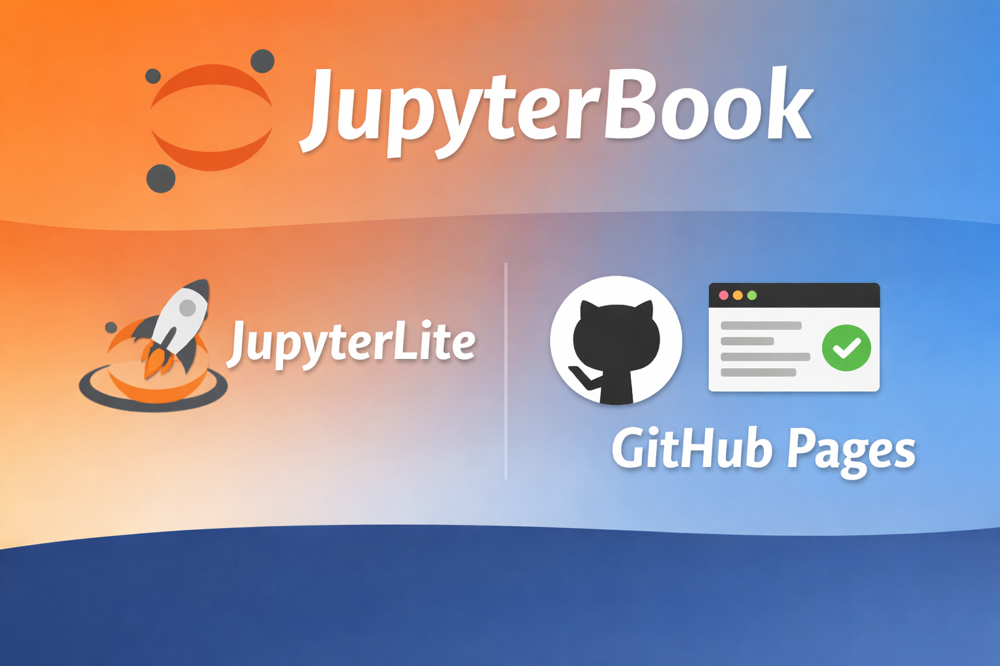

# JupyterBook + JupyterLite Template

<p align="center">
	
</p>

<p align="center">
	<a href="https://jupyterbook.org/">
		
	</a>
	<a href="https://jupyterlite.readthedocs.io/">
		
	</a>
	<a href="https://colab.research.google.com/">
		
	</a>
</p>

<p align="center">
	
	
	
	
</p>

A polished, fork-first template to publish notebook-based docs on GitHub Pages with Jupyter Book + JupyterLite.


## What You Need To Do

Nothing in the template file system is required to make deployment work.

1. Click `Use this template` (or fork this repository).
2. Clone your new repository.

## GitHub Deployment (No Local Build Required)

After creating your repo from this template:

1. Go to `Settings -> Actions -> General` and allow workflows to run.
2. Go to `Settings -> Pages` and set source to `GitHub Actions`.
3. Push to `main`.

GitHub Actions will automatically build and deploy your site.

Your site URL will be:

- `https://<your-github-username>.github.io/<your-repo-name>/`

## Local Preview (Optional)

```bash
pip install -r requirements.txt
jupyter-book build notebooks/
```

Then open `notebooks/_build/html/index.html`.

## Where To Put Content

- Add notebooks in `notebooks/`.
- Update `notebooks/_toc.yml` with page names (without `.ipynb`).
- Update `notebooks/_config.yml` with your repository URL, title, and author.

## Extensions

- `extensions/forced_jupyterlite_button.py` ensures reliable JupyterLite launch links in generated pages.
- `extensions/markdown_code_to_pyodide.py` converts Markdown blocks tagged with `python_code_block` into JupyterLite-ready runnable snippets, enabling a smooth offline Python experience in the browser.
- `extensions/auto_notebook_creation_using_toc.py` automatically generates placeholder notebooks from entries defined in `_toc.yml`, making content scaffolding faster and more consistent.

## Notes
- `.github/workflows/build_and_deploy.yml` is preconfigured for GitHub Pages deployment.
